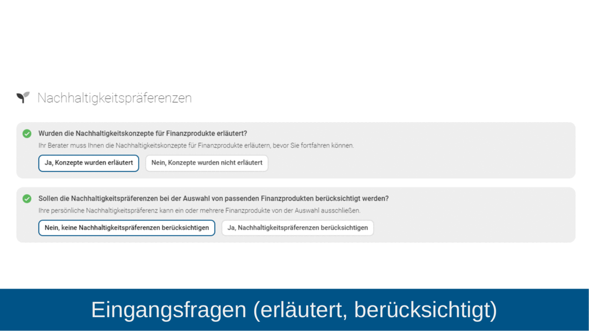
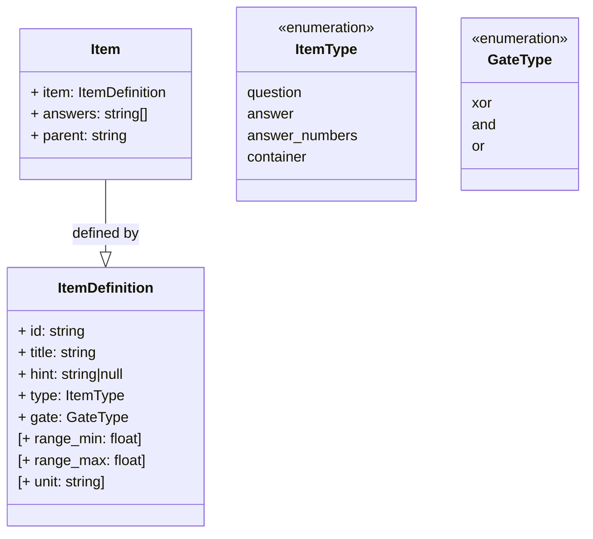

# ESG-Open-Data Projekt

[![CC BY 4.0][cc-by-image]][cc-by]

---

# Standard für ESG Datenerfassung

Wir veröffentlichen hier die notwendigen Informationen darüber, wie die standardisierte und MiFID-II-konforme Abfrage der ESG-Präferenzen umgesetzt werden kann. Dies ermöglicht es Dritten, diese Abfragen in ihren Softwarelösungen und Systemen auf dieselbe Art und Weise zu integrieren.

Die Abfrage der ESG-Präferenzen wird voraussichtlich ab April 2023 auch für Finanzanlagenvermittler nach 34f GewO und Honorarfinanzanlagenberater nach 34h GewO verpflichtend. Aufgrund der Komplexität der gesetzlichen Anforderungen erwarten wir, dass verschiedene Lösungen für die ESG-Abfrage die geforderten Daten unterschiedlich erfassen und strukturieren. Wenn diese dann für den Abgleich auf ebenfalls unterschiedlich aufbereitete Nachhaltigkeitsprofile der Produkte treffen, erschwert das die Arbeit für alle Beteiligten.

Mit der Veröffentlichung der Struktur, wie wir sie für die Abfrage auf unserer Online-Beratungsplattform Walnut Live umgesetzt haben, wollen wir dem entgegenwirken. So können sich beispielsweise Emissionshäuser und Anbieter von Finanzprodukten bei der ESG-Dokumentation für ihre Produkte an dieser Datenstruktur orientieren. Systeme, die diesem Datenstandard entsprechen, können in Zukunft Daten einfacher austauschen, abgleichen und für Im- und Exporte bereitstellen.

Den Quellcode für die Datenstruktur zur Erfassung der Nachhaltigkeitspräferenzen stellen wir unter einer Creative-Commons-Lizenz frei zur Verfügung.

Hier können Sie sich ein Bild von der Struktur der Datenabfrage machen: https://walnut-live.github.io/esg-open-data/


## Referenzimplementierungen

### Walnut Live
Eine Referenzimplementierung befindet sich in der  [Online Beratungsplattform mit digitaler Zeichnung für AIF und
Vermögensanlagen Walnut Live](https://walnut.live). 


---

Technik
==================
Unsere Datenstruktur liegt in einer flachen und alternativ in einer hierarchischen JSON-Struktur vor.

Element Aufbau
------------------
Die folgenden Beispiele erläutern den Aufbau der Datenstruktur.



**Beispiel Element *initial_yes***

```yaml
{
  "item": {
    "id": "initial_yes",
    "title": "Ja, Konzepte wurden erl\u00e4utert",
    "type": "answer"
  },
  "parent": "initial",
  "answers": [
    "consider"
  ]
}
```

Das Element besteht aus einer Definition in der Property `item`und einem Verweis auf das Elternelement in der Property
`parent`, das an
`item.id` erkannt wird. Die Antwortmöglichkeiten befinden sich in der Property `answers` als String-Array definiert.
Auch hier werden die jeweiligen Antwort-Elemente an der Property `item.id` erkannt.

Item-Typen
------------------
Folgende Typen werden aktuell verwendet:
- **question**: Frage Element mit 1-n Antworten
- **answer**: Einfache Antwort (z.B. Ja oder Nein)
- **answer_numbers**: Einstellbare Antwort. Definiert mit range_min (Anfangswert), range_max (Endwert) und unit
  (Einheit z.B. "%")
- **container**: Dient der Darstellung von Kinderelementen

Gatter-Typen
------------------
Folgende Gatter-Typen werden aktuell verwendet:
- **or**: Es muss mindestens eine Antwort gewählt werden
- **xor**: Es muss eine Frage gewählt werden
- **and**: Es müssen alle Fragen beantwortet werden

Flache JSON Struktur
------------------
Hierbei handelt es sich um ein JSON-Objekt, das als Eigenschaften alle `item.id` definiert. So lassen sich die Elemente aus den Beziehungen `parent` und `answers` wiederfinden.

Die aktuelle Version befindet sich in der Datei [esg_flat.de.json](esg_flat.de.json).

```yaml
[
  "initial": {
    "item": {
      "id": "initial",
      "title": "Wurden %firstname% %lastname% die Nachhaltigkeitskonzepte f\u00fcr Finanzprodukte erl\u00e4utert?",
      "type": "question",
      "hint": "Ihr Berater muss Ihnen die Nachhaltigkeitskonzepte f\u00fcr Finanzprodukte erl\u00e4utern, bevor Sie fortfahren k\u00f6nnen."
    },
    "parent": null,
    "answers": [
      "initial_no",
      "initial_yes"
    ],
  },
  "initial_no": {
    "item": {
      "id": "initial_no",
      "title": "Nein, Konzepte wurden nicht erl\u00e4utert",
      "type": "answer"
    },
    "parent": "initial"
  },
  "initial_yes": {
    "item": {
      "id": "initial_yes",
      "title": "Ja, Konzepte wurden erl\u00e4utert",
      "type": "answer"
    },
    "parent": "initial",
    "answers": [
      "consider"
    ]
  }
]
```

Hierarchische JSON Struktur
------------------
Hierbei handelt es sich um ein JSON-Objekt, das als Array definiert ist. Innerhalb des Arrays befinden sich die
gleichen Eigenschaften, wie in der [flachen JSON-Struktur](#Flache-JSON-Struktur), aber zusätzlich erweitert um
die Property `children`. Diese Property beinhaltet nun alle Kinderelemente, sodass nicht mehr danach gesucht werden
muss.

Die aktuelle Version befindet sich in der Datei [esg_hierarchical.de.json](esg_hierarchical.de.json).

```yaml
[
  {
    "item": {
      "id": "initial",
      "title": "Wurden %firstname% %lastname% die Nachhaltigkeitskonzepte f\u00fcr Finanzprodukte erl\u00e4utert?",
      "type": "question",
      "hint": "Ihr Berater muss Ihnen die Nachhaltigkeitskonzepte f\u00fcr Finanzprodukte erl\u00e4utern, bevor Sie fortfahren k\u00f6nnen."
    },
    "parent": null,
    "answers": [
      "initial_no",
      "initial_yes"
    ],
    "children": [
      {
        "item": {
          "id": "initial_no",
          "title": "Nein, Konzepte wurden nicht erl\u00e4utert",
          "type": "answer"
        },
        "parent": "initial",
        "children": [ ]
      },
      {
        "item": {
          "id": "initial_yes",
          "title": "Ja, Konzepte wurden erl\u00e4utert",
          "type": "answer"
        },
        "parent": "initial",
        "answers": [
          "consider"
        ],
        "children": [ ... ]
      }
    ]
  }
]
```

---

Rechtlicher Hintergrund
==================

Wertpapierdienstleistungsunternehmen müssen ab dem 2. August 2022 Nachhaltigkeitspräferenzen von Kunden bei der
Anlageberatung und Portfolioverwaltung berücksichtigen. Dies ist durch eine Anpassung der Delegierten Verordnung
geregelt und hat das Ziel, Nachhaltigkeit in die Finanzberatung zu integrieren und Kapitalströme in umweltfreundliche
Investitionen zu leiten.

Gemäß der angepassten MiFID II-Verordnung vom 02.08.2021 werden die folgenden Abfragen hinzugefügt:

> - [..] die Entscheidung eines Kunden oder potenziellen Kunden darüber, ob und, wenn ja,
    inwieweit eines der folgenden Finanzinstrumente in seine Anlage einbezogen werden soll:
    >
    >  a) mit Mindestanteil Taxonomie-konformer Investitionen ([[6] EU 2020/852](#Quellenangaben));
    > im Sinne von Artikel 2 Nummer 1 der Verordnung (EU) 2020/852
    >
    >  b) mit Mindestanteil nachhaltiger Investitionen im Sinne von Artikel 2 Nummer 17 der Verordnung (EU)
    2019/2088 ([[7] EU 2019/2088](#Quellenangaben))
    >
    >   c) ein Finanzinstrument, bei dem die wichtigsten nachteiligen Auswirkungen auf Nachhaltigkeitsfaktoren
    berücksichtigt werden, wobei die qualitativen oder quantitativen Elemente, mit denen diese Berücksichtigung
    nachgewiesen werden, vom Kunden oder potenziellen Kunden bestimmt werden;
> - Nachhaltigkeitsfaktoren‘ Nachhaltigkeitsfaktoren gemäß Artikel 2 Nummer 24 der Verordnung (EU) 2019/2088;
> - Nachhaltigkeitsrisiken‘ Nachhaltigkeitsrisiken gemäß Artikel 2 Nummer 22 der Verordnung (EU) 2019/2088
>
> *vgl. [[4] - Einbeziehung von Nachhaltigkeitsfaktoren, -risiken und -präferenzen in bestimmte organisatorische
Anforderungen und Bedingungen für die Ausübung der Tätigkeit von Wertpapierfirmen](#Quellenangaben)*

Die BaFin Veröffentlichung [[11] - "EU-Offenlegungsverordnung: Startschuss für mehr Transparenz"](#Quellenangaben)
bietet eine weitere Übersicht zum Thema.

### Implementierungszeitraum

Folgender Implementierungszeitraum ist aktuell von der ESMA vorgesehen:
> 
>
> *vgl. [[3] - Sustainability Finance - Implementation timeline](#Quellenangaben)*

### Taxonomie Verordnung

> Die EU Taxonomie-Verordnung ist eine Verordnung der Europäischen Union, die im Juni 2021 in Kraft getreten ist. Sie
> legt
> einen Rahmen für eine gemeinsame EU-weite Klassifikation nachhaltiger Wirtschaftstätigkeiten fest. Die Taxonomie dient
> als Referenzrahmen, um nachhaltige Wirtschaftstätigkeiten von un-nachhaltigen zu unterscheiden und so Investoren und
> Unternehmen bei der Verwendung nachhaltiger Finanzinstrumente zu unterstützen.
>
> Die EU Taxonomie-Verordnung legt sechs Umweltziele fest, die erreicht werden sollen (Klimawandel, Übernutzung von
> Wasserressourcen, Übernutzung von marinen Ressourcen, Verlust von Biodiversität, Verunreinigung von Luft, Wasser und
> Boden), und definiert acht Wirtschaftstätigkeiten als ökologisch nachhaltig, wenn sie diese Ziele unterstützen. Diese
> Wirtschaftstätigkeiten umfassen unter anderem erneuerbare Energien, Energieeffizienz, Abfallvermeidung und
> -entsorgung.
>
> *vgl. [[5] - EU taxonomy for sustainable activities](#Quellenangaben)*

### Nachhaltige Investitionen

> Eine "nachhaltige Investition" eine Investition in eine wirtschaftliche Tätigkeit, die zur Erreichung eines
> Umweltziels
> beiträgt, gemessen beispielsweise an Schlüsselindikatoren für Ressourceneffizienz bei der Nutzung von Energie,
> erneuerbarer Energie, Rohstoffen, Wasser und Boden, für die Abfallerzeugung, und Treibhausgasemissionen oder für
> die Auswirkungen auf die biologische Vielfalt und die Kreislaufwirtschaft, oder eine Investition in eine
> wirtschaftliche
> Tätigkeit, die zur Erreichung eines sozialen Ziels beiträgt, insbesondere eine Investition, die zur Bekämpfung von
> Ungleichheiten beiträgt oder den sozialen Zusammenhalt, die soziale Integration und die Arbeitsbeziehungen fördert
> oder eine Investition in Humankapital oder zugunsten wirtschaftlich oder sozial benachteiligter Bevölkerungsgruppen,
> vorausgesetzt, dass diese Investitionen keines dieser Ziele erheblich beeinträchtigen und die Unternehmen, in die
> investiert wird, Verfahrensweisen einer guten Unternehmensführung anwenden, insbesondere bei soliden
> Managementstrukturen, den Beziehungen zu den Arbeitnehmern, der Vergütung von Mitarbeitern sowie der
> Einhaltung der Steuervorschriften
>
> *vgl. [[7] EU 2019/2088 - Artikel 2 Nummer 17](#Quellenangaben)*

### Principal Adverse Impact

Aus [[9] - EU 2022/1288 - Ergänzung der Verordnung (EU) 2019/2088 - Anhang 1, Tabelle 1](#Quellenangaben)) lassen sich
die Principal
Adverse Impacts (kurz PAIs) herauslesen.

### Veröffentlichung von Informationen

Die Veröffentlichungspflichten lassen sich aus
der [[9] - EU 2022/1288 - Ergänzung der Verordnung (EU) 2019/2088](#Quellenangaben))
entnehmen:

> **Artikel 4: Erklärung der Finanzmarktteilnehmer, dass sie die wichtigsten nachteiligen Auswirkungen ihrer
Investitionsentscheidungen auf Nachhaltigkeitsfaktoren berücksichtigen**
>
> (1) Die Finanzmarktteilnehmer veröffentlichen bis zum 30. Juni jedes Jahres gemäß Artikel 4 Absatz 1 Buchstabe a bzw.
> Artikel 4 Absätze 3 oder 4 der Verordnung (EU) 2019/2088 auf ihren Internetseiten in einem gesonderten Abschnitt mit
> dem Titel: „Erklärung zu den wichtigsten nachteiligen Auswirkungen von Investitionsentscheidungen auf Nachhaltigkeits
> faktoren“ die in Artikel 4 Absatz 1 Buchstabe a und Artikel 4 Absätze 2, 3 und 4 der Verordnung (EU) 2019/2088 sowie
> in den Artikeln 4 bis 10 der vorliegenden Verordnung genannten Informationen. Diese Informationen müssen sich auf den
> Zeitraum vom 1. Januar bis zum 31. Dezember des vorangegangenen Jahres beziehen und werden gemäß Artikel 23 der
> vorliegenden Verordnung in einem Abschnitt mit dem Titel „Nachhaltigkeitsbezogene Offenlegungen“ veröffentlicht.
>
> (2) Die Finanzmarktteilnehmer veröffentlichen die in Absatz 1 genannte Erklärung nach dem Muster der in Anhang I
> Tabelle 1 enthaltenen Vorlage.
>
> *vgl. [[9] - EU 2022/1288 - Ergänzung der Verordnung (EU) 2019/2088 - Artikel 4](#Quellenangaben)*

Zusätzlich sind mindestens die folgenden Artikel zu beachten

- Artikel 5: Abschnitt Zusammenfassung
- Artikel 6: Beschreibung der wichtigsten nachteiligen Auswirkungen von Investitionsentscheidungen auf
  Nachhaltigkeitsfaktoren
- Artikel 7: Beschreibung der Strategien zur Feststellung und Gewichtung der wichtigsten nachteiligen Auswirkungen von
  Investitionsentscheidungen auf Nachhaltigkeitsfaktoren
- Artikel 8: Abschnitt „Mitwirkungspolitik“
- Artikel 9: Abschnitt „Bezugnahme auf international anerkannte Standards“
- Artikel 10: Historischer Vergleich
- Artikel 11: Erklärung von Finanzberatern, dass sie in ihrer Versicherungs- oder Anlageberatung die wichtigsten
  nachteiligen
  Auswirkungen auf Nachhaltigkeitsfaktoren berücksichtigen
- Artikel 12: Erklärung von Finanzmarktteilnehmern, dass sie nachteilige Auswirkungen ihrer Investitionsentscheidungen
  auf
  Nachhaltigkeitsfaktoren nicht berücksichtigen
- Artikel 13: Erklärung von Finanzberatern, dass sie in ihrer Anlage- oder Versicherungsberatung nachteilige
  Auswirkungen
  ihrer Investitionsentscheidungen auf Nachhaltigkeitsfaktoren nicht berücksichtigen

### Abfrage von Nachhaltigkeitspräferenzen beim Kunden

Die Definition von Nachhaltigkeitspräferenzen lässt sich aus [[9] - EU 2021/1253 - Artikel 1, 1.](#Quellenangaben)
entnehmen:

> **Nachhaltigkeitspräferenzen** die Entscheidung eines Kunden oder potenziellen Kunden darüber, ob und, wenn ja,
> inwieweit eines der folgenden Finanzinstrumente in seine Anlage einbezogen werden soll:
>
> a) ein Finanzinstrument, bei dem der Kunde oder potenzielle Kunde bestimmt, dass ein Mindestanteil in
> ökologisch nachhaltige Investitionen im Sinne von Artikel 2 Nummer 1 der Verordnung (EU) 2020/852 des
> Europäischen Parlaments und des Rates (*) angelegt werden soll;
>
> b) ein Finanzinstrument, bei dem der Kunde oder potenzielle Kunde bestimmt, dass ein Mindestanteil in
> nachhaltige Investitionen im Sinne von Artikel 2 Nummer 17 der Verordnung (EU) 2019/2088 des
> Europäischen Parlaments und des Rates (**) angelegt werden soll;
>
> c) ein Finanzinstrument, bei dem die wichtigsten nachteiligen Auswirkungen auf Nachhaltigkeitsfaktoren
> berücksichtigt werden, wobei die qualitativen oder quantitativen Elemente, mit denen diese Berücksichtigung
> nachgewiesen werden, vom Kunden oder potenziellen Kunden bestimmt werden;

Wir richten uns bei der Detaillierung der PAIs vollständig an den
[Veröffentlichungspflichten der Finanzteilnehmer](#Veröffentlichung-von-Informationen) und bieten dem Kunden die
Möglichkeit, eine qualitative und quantitative Auswahl der
Elemente gemäß den geforderten Nachhaltigkeitspräferenzen zu treffen.

Quellenangaben
==================

1. PDF-Dokument, **"DELEGIERTE VERORDNUNG (EU) 2021/1253 DER KOMMISSION"**
   _EUR-Lex_ vom 21.04.2021,
   veröffentlicht auf https://eur-lex.europa.eu/legal-content/DE/TXT/PDF/?uri=CELEX:32021R1253&from=DE
   (abgerufen am 27.01.2023)
2. Webseite, **"Nachhaltigkeit: Präferenzen der Kundinnen und Kunden beachten"**
   in *Bundesanstalt für Finanzwesen*, 03.08.2022,
   veröffentlicht auf https://www.bafin.de/dok/18344288
   (abgerufen am 27.01.2023)
3. PDF-Dokument, "**Sustainability Finance - Implementation timeline**"
   in *ESMA - European Securities and Markets Authorities* vom 26.09.2022,
   veröffentlicht
   in https://www.esma.europa.eu/esmas-activities/sustainable-finance/investment-services-and-fund-management
   (abgerufen am 27.01.2023)
4. PDF-Dokument, "**Einbeziehung von Nachhaltigkeitsfaktoren, -risiken und -präferenzen in bestimmte organisatorische
   Anforderungen und Bedingungen für die Ausübung der Tätigkeit von Wertpapierfirmen**"
   in *EUR-Lex* vom 02.08.2021,
   veröffentlicht in https://eur-lex.europa.eu/legal-content/DE/TXT/PDF/?uri=CELEX:32021R1253&from=DE
   (abgerufen am 27.01.2023)
5. Webseite, **"EU taxonomy for sustainable activities"**
   in European Commission,
   veröffentlicht
   in https://finance.ec.europa.eu/sustainable-finance/tools-and-standards/eu-taxonomy-sustainable-activities_en
   (abgerufen am 27.01.2023)
6. PDF-Dokument, **"EU 2020/852 - Einrichtung eines Rahmens zur Erleichterung nachhaltiger Investitionen und zur
   Änderung der Verordnung (EU) 2019/2088"**
   in *EUR-Lex* vom 22.06.2020,
   veröffentlicht in https://eur-lex.europa.eu/legal-content/DE/TXT/PDF/?uri=CELEX:32020R0852&from=DE
   (abgerufen am 27.01.2023)
7. PDF, **"EU 2019/2088 - Nachhaltigkeitsbezogene Offenlegungspflichten im Finanzdienstleistungssektor"**
   in *EUR-Lex* vom 9.12.2019
   veröffentlicht in https://eur-lex.europa.eu/legal-content/DE/TXT/PDF/?uri=CELEX:32019R2088&from=DE
   (abgerufen am 27.01.2023)
8. Webseite, **"Principal adverse impact and product templates for the Sustainable Finance Disclosure Regulation"**
   in *European Insurance and Occupational Pensions Authority* vom 26.07.2022,
   veröffentlicht
   in https://www.eiopa.europa.eu/document-library/other-documents/principal-adverse-impact-and-product-templates-sustainable-finance_en
   (abgerufen am 27.01.2023)
9. PDF-Dokument, **"EU 2022/1288 - Ergänzung der Verordnung (EU) 2019/2088"**
   in *EUR-LEX* vom 25.07.2022
   veröffentlicht in https://eur-lex.europa.eu/legal-content/DE/TXT/?uri=CELEX%3A32022R1288&qid=1675246298585
   (abgerufen am 27.01.2023)
10. PDF-Dokument, **"EU 2021/1253 zur Änderung der Delegierten Verordnung (EU) 2017/565 im Hinblick auf die
    Einbeziehung von
    Nachhaltigkeitsfaktoren, -risiken und -präferenzen in bestimmte organisatorische Anforderungen
    und Bedingungen für die Ausübung der Tätigkeit von Wertpapierfirmen"**
    in *EUR-LEX* vom 21.04.2021
    veröffentlicht in https://eur-lex.europa.eu/legal-content/DE/TXT/PDF/?uri=CELEX:32021R1253&from=DE
    (abgerufen am 27.01.2023)
11. PDF-Dokument, **"EU 2021/1269 zur Änderung der Delegierten Richtlinie (EU) 2017/593 durch Einbeziehung von
    Nachhaltigkeitsfaktoren in die Produktüberwachungspflichten"**
    in *EUR-LEX* vom 21.04.2021
    veröffentlicht in https://eur-lex.europa.eu/legal-content/DE/TXT/PDF/?uri=CELEX:32021L1269&from=DE
    (abgerufen am 27.01.2023)
12. Webseite, **"EU-Offenlegungsverordnung: Startschuss für mehr Transparenz"**
    in *BaFin - Bundesanstalt für Finanzdienstleistungsaufsicht* vom 16.12.2022
    veröffentlicht
    in https://www.bafin.de/SharedDocs/Veroeffentlichungen/DE/Fachartikel/2022/fa_bj_2212_Offenlegungsverordnung.html
    (abgerufen am 27.01.2023)

---

Haftungsausschluss
==================
Die Software wird "wie besehen" bereitgestellt und die Verantwortung für etwaige Schäden, die aus der
Verwendung der Software resultieren, wird abgelehnt. Der Entwickler übernimmt keine Garantie für die
Funktionalität der Software und übernimmt keine Haftung für Schäden jeglicher Art, einschließlich
direkter, indirekter, beiläufiger, besonderer oder Folgeschäden. Die Nutzung der Software erfolgt
auf eigene Gefahr. Die in der Software enthaltenen Informationen dienen ausschließlich zu
Informationszwecken und stellen keine Rechtsberatung dar. Es wird empfohlen, bei rechtlichen
Fragen einen Anwalt zu konsultieren.


---

Lizenz
==================

Das Projekt ist lizenziert unter
[Creative Commons Attribution 4.0 International License][cc-by].

[![CC BY 4.0][cc-by-image]][cc-by]

[cc-by]: http://creativecommons.org/licenses/by/4.0/deed.de

[cc-by-image]: https://i.creativecommons.org/l/by/4.0/88x31.png
